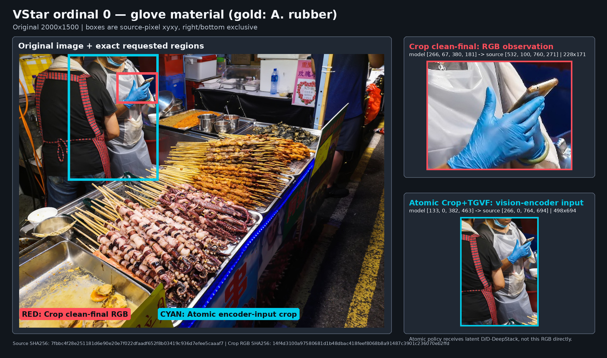
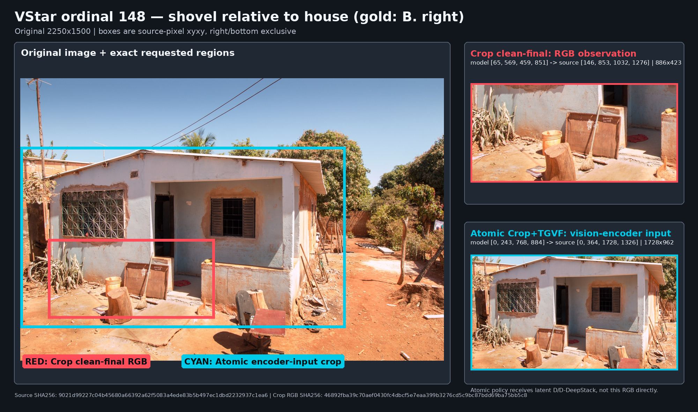
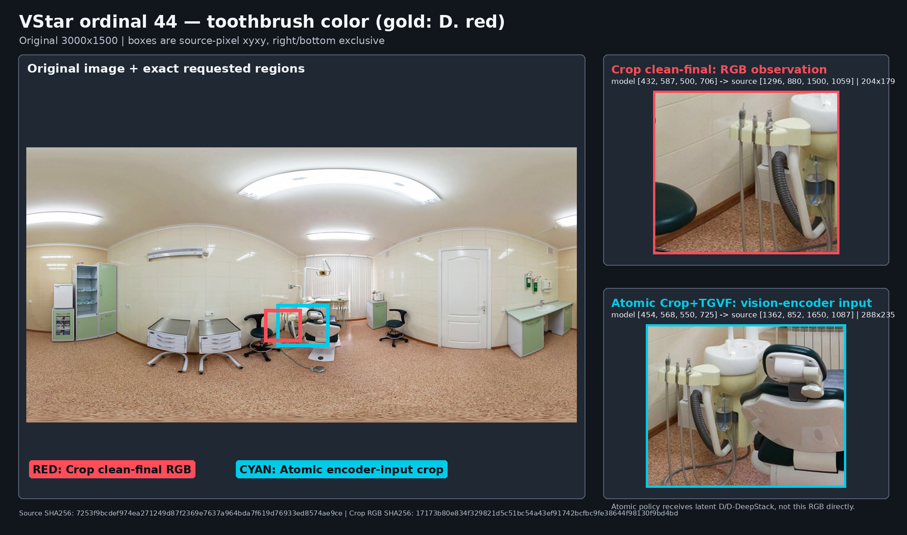

# Policy RL 主流线路实际推理实例

**日期：** 2026-08-14
**状态：** `ACTUAL COREDEV TRAJECTORY RECORD / FROZEN`
**范围：** Crop clean-final、RP67 T-free Frozen、RP67 Focus/Grounding visual reward、Atomic Crop+TGVF

## 1. 本文记录什么

本文保存四条主流 policy-RL 线路在正式 CoreDev-2511 测试中产生的真实
inference trajectory。这里的题目、工具调用、模型续写、最终答案、`hit` 和
trajectory SHA 都来自归档 artifact；它们不是手写 prompt 示例，也不是根据图片
事后补出的理想答案。

本文选用的主 checkpoint 是：

| 线路 | checkpoint | inference tool | CoreDev Macro* | 选择原因 |
|---|---:|---|---:|---|
| Crop clean-final | Step 8 | `image_zoom_in_tool(bbox_2d, label)` | **59.7161** | Crop 主线最佳 checkpoint |
| RP67 T-free Frozen | Step 16 | `tgvf_focus_tool(target)` | **58.1996** | 纯 TGVF 主线最佳 checkpoint |
| RP67 Frozen + Focus/Grounding visual reward | Step 8 | `tgvf_focus_tool(target)` | **57.8849** | visual-reward 主线最佳 checkpoint |
| Atomic Crop+TGVF | Step 8 | `tgvf_crop_tool(bbox_2d, target)` | **62.1168** | 当前四线最佳 Macro* checkpoint |

其中第 4 节为了隔离 Focus/Grounding reward 的影响，额外使用 RP67 T-free Frozen
**Step 8** 与 visual-reward **Step 8** 做同 step、同 paired RNG stream 的实例对照。
这不改变上表中纯 TGVF 主 checkpoint 仍为 Step 16。

## 2. 阅读约定与证据边界

### 2.1 Observation 如何记录

- Crop 的 observation 是原图上的真实 RGB crop。trajectory audit 保存请求 bbox、
  转换后的 source-pixel bbox、crop 尺寸与 RGB SHA256，但不把图片像素内嵌到 JSONL。
- 纯 TGVF 的 observation 是原图条件的 latent `D` 与 D-DeepStack。
- Atomic Crop+TGVF 先 crop，再由 Qwen vision 与 frozen RP67 生成该 crop 条件的
  latent `D`；policy 不接收 RGB crop 本身。
- TGVF 两条路径的 evaluation JSONL **没有把 latent observation 序列化成自然语言**。
  因而下文只写“`[latent D + D-DeepStack; audit 中无可读文本]`”，随后展示真实的
  post-tool decode。任何更具体的“D 说了什么”都将是杜撰。
- 纯 TGVF 与 visual-reward TGVF 只生成 `target`，没有离散 spatial bbox；因此不能
  像 Crop 一样在原图上画出一个“真实截图框”。下文的红/蓝框只对应 Crop 与
  Atomic Crop+TGVF 的实际 crop action。

### 2.2 Visual reward 在测试时不调用 judge

“RP67 Focus/Grounding visual reward”中的 Focus/Grounding API VLM judge 只用于
**训练期 reward**。正式 inference 时，它与普通 Frozen RP67 一样调用
`tgvf_focus_tool`；测试过程不再次调用 reward judge。因此本文展示的是
“由该 reward 训练得到的 checkpoint 如何推理”，不是 judge 给测试样本写的解释。

### 2.3 转录与评分

- 工具调用和回答文本来自 `assistant_turns[].raw_text` / `final_answer`；源记录中存在的
  `<|im_end|>` 在主要逐字实例中保留。
- `gold` 与 `hit` 来自相应正式 scorer 的 `*_result.tsv`，不是本文重新判分。
- 单条实例用于理解行为机制与失败形态，不能替代基于 2,511-row manifest 的
  CoreDev aggregate；本文可逐条审计的实际 inference 覆盖其中 2,240 条单图，
  另外 271 条多图任务在该工具评测协议中显式 hold。
- Crop、纯 TGVF 与 Atomic Crop+TGVF 属于不同 prompt/tool/RNG block；跨线路同题
  并排是定性审阅，不是严格 causal delta。只有第 4 节明确标注的两条 Step 8
  TGVF trajectory 使用同一个 paired RNG stream。

## 3. 四线共同成功：识别手套材质

**Dataset：** VStarBench
**Ordinal：** `0`
**Sample ID：**
`vstar_test_questions_191/vstar_bench_snapshot_test_questions_jsonl/0_000000`
**Gold：** `A. rubber`

### 3.1 Question

```text
Question: What is the material of the glove?
Options:
A. rubber
B. cotton
C. kevlar
D. leather
Please select the correct answer from the options above.
```

红框是 Crop clean-final 的实际 RGB observation；蓝框是 Atomic Crop+TGVF 进入
视觉编码器的 crop。右侧展示对应 source-pixel 区域，图中仅为显示而缩放：



### 3.2 Crop clean-final Step 8

实际工具调用：

```text
<tool_call>
{"name": "image_zoom_in_tool", "arguments": {"bbox_2d": [266, 67, 380, 181], "label": "a blue glove on a person's hand"}}
</tool_call><|im_end|>
```

Audit 中的实际 crop：

```text
relative bbox:        [266, 67, 380, 181]
source-pixel bbox:    [532, 100, 760, 271]
source size:          2000 x 1500
crop size:            228 x 171
crop RGB SHA256:      14f4d3100a97580681d1b48dbac418feef8068b8a91487c3901c236070eb2ffd
```

实际 post-tool 输出：

```text
The glove in the image is blue and appears to be made of a flexible, thin
material commonly used for protective or hygiene purposes in food service.
This material is typically latex or nitrile, which are types of rubber.
Given the options provided, rubber (option A) is the most likely material.

Final Answer: A. rubber<|im_end|>
```

**Scorer：** `hit=1`
**Trajectory SHA256：**
`0b1c1b560fd17327d0f86e66543d7628767443aac7de1bb0bd2cc61a856dbfee`

### 3.3 RP67 T-free Frozen Step 16

实际工具调用：

```text
<tool_call>
{"name": "tgvf_focus_tool", "arguments": {"target": "the blue glove worn by the person in the image, focusing on its texture and appearance to determine its material"}}
</tool_call>
```

实际 observation 类型：

```text
[latent D + D-DeepStack; audit 中无可读 observation 文本]
```

实际 post-tool 输出：

```text
The glove on the person's hand looks slightly opaque and elastic with glossy
texture, with blue latex-like rubber tread, not cotton, kevlar, or leather.
After checking, the glove feels soft and stretchy, matching rubber.

The glove is made of blue rubber.

The glove has the appearance of a typical rubber glove.

The glove is made of rubber.

The glove is made of rubber.

The glove is not cotton, kevlar, or leather.<|im_end|>
```

**Scorer：** `hit=1`
**Trajectory SHA256：**
`c6587209ab14937abe5dbf75b6214b75f0d1ea2aad5a7fa0e577bb8df17127e7`

这个实例也暴露了 Frozen Step 16 的一个真实边界：答案正确，但出现重复 tail，
所以“答对”不等于输出形态完全健康。

### 3.4 RP67 Focus/Grounding visual reward Step 8

实际工具调用：

```text
<tool_call>
{"name": "tgvf_focus_tool", "arguments": {"target": "the blue glove worn by the person in the image, focusing on its texture and appearance to determine its material"}}
</tool_call>
```

实际 observation 类型：

```text
[latent D + D-DeepStack; audit 中无可读 observation 文本]
```

实际 post-tool 输出：

```text
The glove on the person's hand looks slightly opaque and elastic with smooth
texture, consistent with latex or rubber, not leather (which is rougher/darkest
brown), knit cotton (which feels soft/blank, not this form), or kevlar (too stiff).

The glove has the smooth shiny surface typical of textured rubber, not cotton
or leather.

The glove seems to be made of rubber.

A. rubber<|im_end|>
```

**Scorer：** `hit=1`
**Trajectory SHA256：**
`c2717eec9dc90ca2d4d447e780ffcb2e46184e1aed345ea22659a36676cb2d17`

### 3.5 Atomic Crop+TGVF Step 8

实际工具调用：

```text
<tool_call>
{"name":"tgvf_crop_tool","arguments":{"bbox_2d":[133,0,382,463],"target":"a close-up of the person's hand wearing a glove to identify its material"}}
</tool_call>
```

实际 observation 类型：

```text
[bbox crop -> Qwen vision -> target-conditioned latent D + D-DeepStack;
 policy 未收到 RGB crop；audit 中无可读 D 文本]
```

实际 post-tool 输出：

```text
The glove has the shiny, flexible, and tightly fitted appearance typical of a
nitrile or latex rubber glove. The material doesn't look like cotton (which
would appear soft and more woven), kevlar (which would be rigid and tough), or
leather (which would look more textured and less glossy).

The material of the glove is rubber.

A. rubber<|im_end|>
```

**Scorer：** `hit=1`
**Trajectory SHA256：**
`5ee9a84b0d0cc5744191b3916041aa0ba44eaa4d7b530b8b356c1a3632c3f6fa`

### 3.6 这个共同成功样本说明什么

四条线路都能把问题转化成与“手套材质”直接相关的视觉动作，并在 observation 后
落到正确答案。差异主要在 observation 载体：Crop 返回 RGB，纯 TGVF 返回原图条件
latent，Atomic 工具返回 crop 条件 latent。该样本证明四种实际 inference 链路都能
跑通，但不能据此给四条线路排序。

## 4. Focus/Grounding reward 的 matched Step 8 个例

这一节只比较 RP67 T-free Frozen Step 8 与 RP67 Focus/Grounding Step 8。两条
trajectory 的 `paired_rng_stream_identity_sha256` 都是：

```text
3c3b9d7c97504b2f1aa0efd7399a3efae37c860fff06a0ad1061aaa04db4ed4f
```

**Dataset：** VStarBench
**Ordinal：** `129`
**Sample ID：**
`vstar_test_questions_191/vstar_bench_snapshot_test_questions_jsonl/129_000129`
**Gold：** `B. left`

```text
Question: Is the cyclist on the left or right side of the woman's handbag?
Options:
A. right
B. left
Please select the correct answer from the options above.
```

### 4.1 RP67 T-free Frozen Step 8：reasoning 与 answer 冲突

```text
<tool_call>
{"name": "tgvf_focus_tool", "arguments": {"target": "the woman's handbag and the cyclist's position relative to it"}}
</tool_call>
```

```text
The view shows a woman walking in the paved path, holding a handbag, and a
cyclist is visible to the left of the handbag in the image. For multiple-choice,
only return the option letter.

A. right<|im_end|>
```

**Scorer：** `hit=0`
**Trajectory SHA256：**
`5b43b8477e7d8890672171a43d2625b960352fed9b9371af7d8869742b734beb`

这里 post-tool reasoning 已经说出 “left”，但 answer channel 输出 `A. right`，是
真实存在的内部结论与最终选择不一致。

### 4.2 Focus/Grounding visual reward Step 8：该样本上保持一致

```text
<tool_call>
{"name": "tgvf_focus_tool", "arguments": {"target": "the woman with the handbag and the cyclist in the image"}}
</tool_call>
```

```text
The woman with the handbag is visible walking on the right side of the paved
path near the traffic light pole. A cyclist is visible on the far left side of
the scene, near the railing. This places the cyclist on the left side of the
woman's handbag.

B. left<|im_end|>
```

**Scorer：** `hit=1`
**Trajectory SHA256：**
`8be3bcf4fbfe4ac454fe09ac2843875e92d5714e99466d15573736c1af3535f9`

这是 visual reward 改善 reasoning/answer 一致性的一个真实正例，但仍只是单样本。
Aggregate 上 visual reward 的 accuracy 非单调：S8 优于 matched no-F/G S8，S16
却低于 matched no-F/G S16。因此不能把该实例扩展成“F/G 已稳定改善准确率”。

## 5. Atomic Crop+TGVF 独立纠错实例

**Dataset：** VStarBench
**Ordinal：** `148`
**Sample ID：**
`vstar_test_questions_191/vstar_bench_snapshot_test_questions_jsonl/148_000148`
**Gold：** `B. right`

```text
Question: Is the shovel on the left or right side of the house?
Options:
A. left
B. right
Please select the correct answer from the options above.
```

这里可以直接看到 Crop 的错误先验来自哪里：红框只覆盖房屋左下区域；Atomic 的
蓝框覆盖了房屋主体和更大的周边区域。右侧为两个 action 对应的真实像素区域：



### 5.1 四条实际 trajectory

#### Crop clean-final Step 8

```text
<tool_call>
{"name": "image_zoom_in_tool", "arguments": {"bbox_2d": [65, 569, 459, 851], "label": "the left side of the house with a shovel leaning against it"}}
</tool_call><|im_end|>
```

实际 crop 为 source-pixel bbox `[146, 853, 1032, 1276]`、大小 `886 x 423`，
RGB SHA256 为
`46892fba39c70aef0430fc4dbcf5e7eaa399b3276cd5c9bc87bdd69ba75bb5c8`。

```text
Based on the analysis of the image, I can see that there is a shovel leaning
against the wall on the left side of the house. The handle of the shovel is
visible, and it is positioned near the wooden barrel and the concrete steps on
the left side of the structure. I have confirmed its location.

The shovel is on the left side of the house.

A. left<|im_end|>
```

**Scorer：** `hit=0`
**Trajectory SHA256：**
`93bca40ad21519bfd8c465f96cc460745aec5f1ea1986d3e16bffdff0529b3e4`

#### RP67 T-free Frozen Step 16

```text
<tool_call>
{"name": "tgvf_focus_tool", "arguments": {"target": "the shovel and its position relative to the house"}}
</tool_call>
```

```text
The shovel is located on the left side of the house in the image.

A. left<|im_end|>
```

**Scorer：** `hit=0`
**Trajectory SHA256：**
`2641c5c26e147c99b9bd8da608131c79311228fb54684ec134348dce12df2fec`

#### RP67 Focus/Grounding visual reward Step 8

```text
<tool_call>
{"name": "tgvf_focus_tool", "arguments": {"target": "the shovel and its position relative to the house"}}
</tool_call>
```

```text
The shovel is located on the left side of the house in the image. The tool
confirms its position as left of the structure. Therefore, the correct option
is A.<|im_end|>
```

**Scorer：** `hit=0`
**Trajectory SHA256：**
`1ed1214b241f71fcac6cf35f2d8e6c53c6a5794db8b559454f684c6d3979dd27`

#### Atomic Crop+TGVF Step 8

```text
<tool_call>
{"name":"tgvf_crop_tool","arguments":{"bbox_2d":[0,243,768,884],"target":"the house and surrounding area to locate the shovel and determine its position relative to the house"}}
</tool_call>
```

```text
The shovel is visible on the right side of the house near the outdoor chair,
not on the left side. The left side shows plants and a bucket.

B. right<|im_end|>
```

**Scorer：** `hit=1`
**Trajectory SHA256：**
`42a492103a7d578ba5878a6ef8ef85504b6ca3a653dcfe8b1e9745f74a38f778`

### 5.2 如何解释

该样本中 Atomic 工具选择了覆盖房屋及周边的较宽 bbox，并以中性的关系判断作为
target；它最终纠正了其他三条 trajectory 的共同错误。Crop 的 label 在调用前就写成
“left side ... with a shovel”，呈现出 action 自带错误假设的风险。

这只是 Atomic 工具的真实成功个例，不是严格 synergy 证明：Atomic 与另外三条线的
tool schema、prompt 和 RNG block 不相同，而且当前没有 Atomic Step 0。

## 6. 细粒度颜色失败边界：定位合理仍可能看错

**Dataset：** VStarBench
**Ordinal：** `44`
**Sample ID：**
`vstar_test_questions_191/vstar_bench_snapshot_test_questions_jsonl/44_000044`
**Question：** `What is the color of the toothbrush?`
**Options：** `A green / B blue / C yellow / D red`
**Gold：** `D. red`

红框和蓝框都落在牙椅附近，但实际 crop 内容主要是牙科器械与软管；这解释了为什么
“调用成功且区域相关”仍不等于目标物体已经清晰可辨：



| 线路 | 实际 action | 实际 final | hit | trajectory SHA256 |
|---|---|---|---:|---|
| Crop clean-final S8 | bbox `[432,587,500,706]`；label `dental equipment around the chair` | `A. green` | 0 | `d6404fceabfae6b2fadcae284bf83e9803fd13ee523c993b8260ecfe0c77eae5` |
| RP67 T-free Frozen S16 | target `the toothbrushes in the dental clinic, specifically their color` | `D. red` | 1 | `aaa1c495317b89241aee10a815c516abd3f44c77d718b7a8324f4fccd924ece9` |
| RP67 visual-reward S8 | target `the toothbrushes in the dental equipment tray on the counter` | `A. green` | 0 | `44c87726ffa3d8e5b5c2f73ec8e7f6002c6938f151e9c4bbcff4dd7c7ef10b7a` |
| Atomic Crop+TGVF S8 | bbox `[454,568,550,725]`；target `the toothbrushes on the dental chair's tray to identify their color` | `C. yellow` | 0 | `31871dbc493a272a2c1d41031acaec0515c1ab5054c6a97fd1c6736a48fa9584` |

Crop 的有效 source-pixel bbox 是 `[1296,880,1500,1059]`，crop 大小 `204 x 179`，
RGB SHA256 是
`17173b80e834f329821d5c51bc54a43ef91742bcfbc9fe38644f98130f9bd4bd`。
这组 action 都与题目相关，仍产生三种颜色判断，说明 target 合理、成功调用工具、
甚至显式 crop 都不保证微小属性一定可辨。它是本文刻意保留的 failure boundary。

## 7. 从实例中可以稳定读出的行为差异

| 线路 | 实际 action 决策 | policy 实际接收 | 实例中观察到的优势 | 实例中观察到的风险 |
|---|---|---|---|---|
| Crop clean-final | 生成 bbox，可附 label | 原图 + RGB crop | 显式定位、crop 可哈希审计 | label 可能先写入错误假设；小 crop 仍可能看错 |
| RP67 T-free Frozen | 生成自然语言 target | 原图条件 latent `D` + D-DeepStack | target 简洁，链路可直接工作 | latent 不可人读；可能重复、answer 与 reasoning 冲突 |
| RP67 F/G visual reward | 与 Frozen 相同 | 与 Frozen 相同 | 个例中 target/空间关系与答案更一致 | reward 只在训练期；并不保证每题或后期 accuracy 更好 |
| Atomic Crop+TGVF | 同时生成 bbox 与 target | crop 条件 latent `D` + D-DeepStack | 同一原子动作结合显式定位与目标条件 | bbox 与 target 都可能错；latent 仍不可人读 |

最重要的结论不是某一个漂亮样本，而是四种 observation contract 的真实差别已经能
在 formal artifact 中被追踪：Crop 可审计像素；TGVF 可审计 target 和后续行为；
Atomic 可同时审计 bbox 与 target。当前 audit 仍不能直接回答 latent `D` 本身包含了
什么自然语言语义，这需要独立的 D probe，而不能靠重写 post-tool reasoning 代替。

## 8. Artifact provenance

下表给出本文实例在 JSONL 中的精确 locator；trajectory SHA 是更稳定的内容身份，
应优先用于机器核对。

| sample | Crop S8 | Frozen S8 | Frozen S16 | Visual S8 | Atomic S8 |
|---|---|---|---|---|---|
| VStar ordinal 0 | `rank-0:7` | — | `rank-0:3` | `rank-0:7` | `rank-0:8` |
| VStar ordinal 129 | — | `rank-1:40` | — | `rank-1:37` | — |
| VStar ordinal 148 | `rank-0:38` | — | `rank-0:33` | `rank-0:35` | `rank-0:39` |
| VStar ordinal 44 | `rank-0:16` | — | `rank-0:11` | `rank-0:14` | `rank-0:15` |

### 8.1 Crop clean-final Step 8

```text
artifacts/evaluation/
  PRL14-A-CoreDev2511-cleanfinal-step0-step8-step16-v1/
    step8/inference/rank-*.jsonl
    step8/scoring/coredev-official-v2/
```

### 8.2 RP67 T-free Frozen Step 8 / Step 16

```text
artifacts/policy/
  PRL-17-R2-qwen3-instruct-full-frozen-rp67-bs16-n16-tfree-novisual-8step-ws8/
    evaluation/
      PRL17-R2-FROZEN-RP67-TFREE-COREDEV2511-STEP0-STEP8-STEP16-PAIRED-SEED-V1/
        step8/inference/rank-*.jsonl
        step16/inference/rank-*.jsonl
        step8/scoring/coredev-official-v1/
        step16/scoring/coredev-official-v1/
```

### 8.3 RP67 Focus/Grounding visual reward Step 8

```text
artifacts/policy/
  PRL-19-R0-qwen3-instruct-full-frozen-rp67-bs16-n16-tfree-visual-api-8step-ws8/
    evaluation/
      PRL19-R0-FROZEN-RP67-TFREE-VISUAL-API-COREDEV2511-STEP8-STEP16-PAIRED-SEED-V1/
        step8/inference/rank-*.jsonl
        step8/scoring/coredev-official-v1/
```

### 8.4 Atomic Crop+TGVF Step 8

```text
artifacts/policy/
  PRL-20-R0-qwen3-instruct-full-frozen-rp67-bs16-n16-tfree-crop-tgvf-8step-ws8/
    evaluation/
      PRL20-R0-FROZEN-RP67-TFREE-CROP-TGVF-COREDEV2511-STEP8-STEP16-PAIRED-SEED-V1/
        step8/inference/rank-*.jsonl
        step8/scoring/coredev-official-v1/
```

Aggregate 数值、跨 block 比较规则和完整结论见：

- `docs/POLICY_RL_COREDEV2511_MEASUREMENT_CONTRACT_AND_BASELINES_20260812.md`
- `docs/POLICY_RL_SMALL_BATCH_PILOT_CLOSEOUT_20260814.md`

三张可视化的 source image SHA、坐标重建规则和 panel SHA 见：

- [crop-region figure provenance](../reports/policy_trajectory_examples/mainlines_20260814/PROVENANCE.md)
