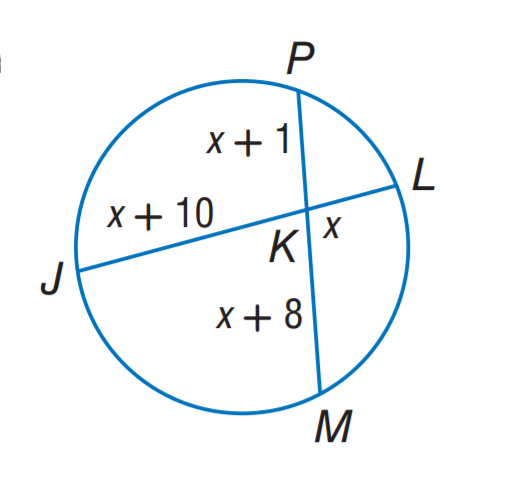
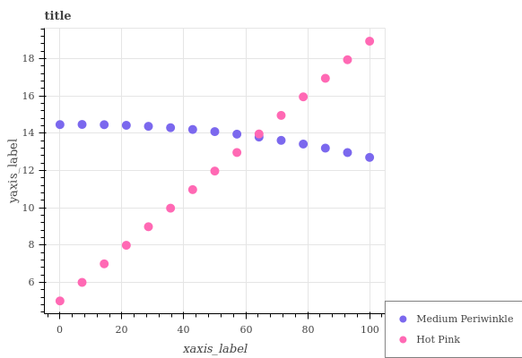
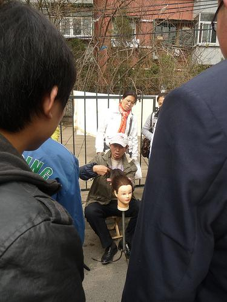
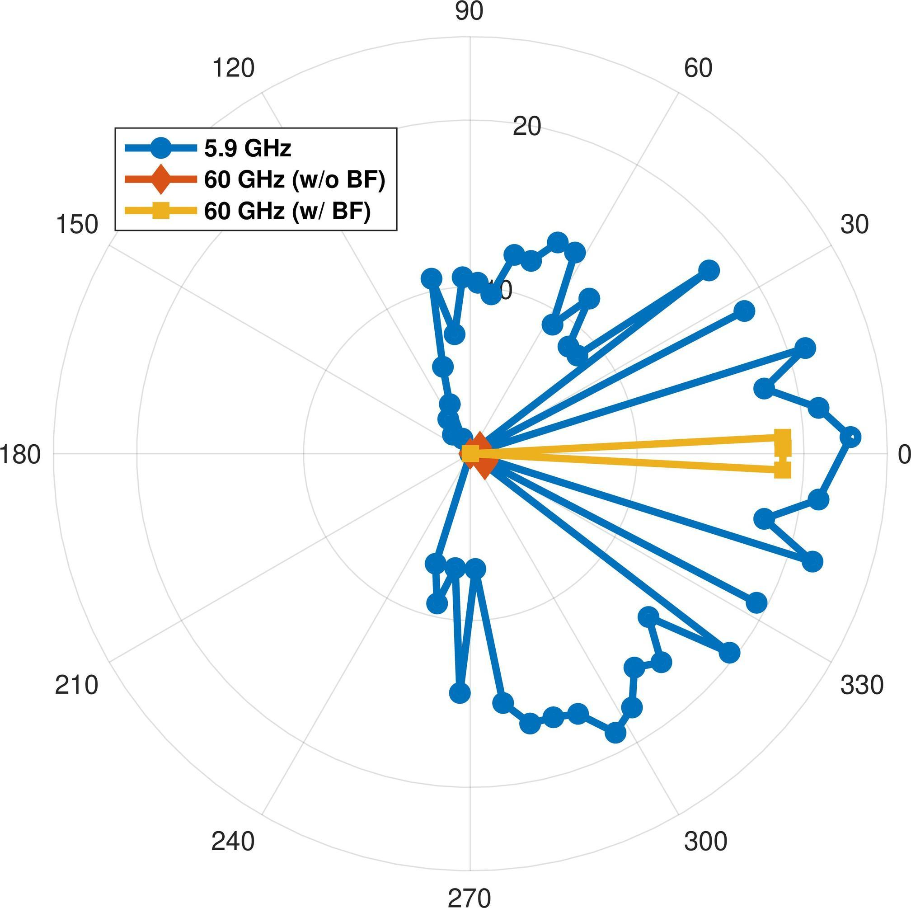

# R3 policy trajectory examples (optimizer step 6)

This page collects a small, deliberately mixed sample of **real trajectories**
from `PRL-02-R3-qwen3-grpo-bs16-tgvf-formal-pilot-80step-gpu0123` at optimizer
step 6. It includes successful tool use, repeated tool use, a direct answer, an
answer error, a verifier-sensitive answer, and protocol-error recovery.

These are qualitative audit examples, not a final model evaluation. R3
completed seven optimizer steps (0 through 6) and stopped during the following
step. Every example below comes from the completed step-6 audit directory; none
comes from the unconsumed partial step.

## How to read this page

- `D` is the target-conditioned visual observation produced by the frozen TGVF
  Adapter. It is injected as materialized visual tensors, so it is not replaced
  here by invented natural-language “tool output.”
- The compact arrows show the real turn structure. The linked JSON preserves
  every assistant turn, exact tool-call text, target, stop reason, reward
  components, errors, trajectory ID, and trajectory SHA-256.
- Reward is the Pilot-v1 composition:
  `0.8 × answer + 0.2 × format + 1.2 × conditional tool`.
- The source images are copied from the fixed DeepEyes 47K snapshot solely so
  that this GitHub report can be inspected without access to local artifacts.

## At a glance

| Example | Rollout behavior | Result | Reward |
| --- | --- | --- | ---: |
| Find x (paired) | direct answer vs. one TGVF call | both correct | 0.8 / 2.0 |
| White wall | one TGVF call | correct | 2.0 |
| Periwinkle vs. Hot Pink | two TGVF calls | correct | 2.0 |
| Monster cake | three TGVF calls | verifier marked wrong | 0.0 |
| T-shirt color | one TGVF call | wrong | 0.0 |
| Radar chart | malformed call, recovery, valid TGVF call | answer correct; protocol invalid | 1.8 |

## 1. Same prompt, direct answer and tool-assisted answer



**Question:** Find x.

**Reference answer:** `8`

This pair is from the same eight-rollout GRPO group. It cleanly shows that the
conditional tool reward changes the scalar reward even when both final answers
are correct.

### Rollout 0: direct answer

```text
image + question
  -> assistant reasoning (no tool call)
  -> final answer: 8
```

- Successful observations: 0
- Reward components: answer `1`, format `0`, conditional tool `0`
- Total reward: `0.8`
- Stop: `direct_answer`
- Trajectory SHA-256:
  `3f9c8d8c1f539fc70495b9f2d6e69b0dcbbd77906d312677d4a8f5c63d4f5d73`
- [Complete raw trajectory](raw/find_x_no_tool.json)

### Rollout 1: one TGVF call

```text
image + question
  -> tgvf_focus_tool(
       target="the intersecting chords theorem application where JK * KL =
               PK * KM with labels x+10, x, x+1, x+8 for the segments"
     )
  -> materialized D
  -> assistant reasoning
  -> final answer: 8
```

- Successful observations: 1
- Reward components: answer `1`, format `0`, conditional tool `1`
- Total reward: `2.0`
- Stop: `final_answer`
- Trajectory SHA-256:
  `a7a0ef68a5612288e0c4ade673c570df05789c423ee8be79eec9b97b2b52aaca`
- [Complete raw trajectory](raw/find_x_tgvf.json)

## 2. Correct single-call visual verification


**Question:** Is the color of the wall white?

**Reference answer:** Yes, the color of the wall is white.

```text
image + question
  -> tgvf_focus_tool(
       target="the color of the wall panels in the background behind the
               giraffe exhibit"
     )
  -> materialized D
  -> final answer: Yes
```

- Successful observations: 1
- Protocol valid: yes
- Reward components: answer `1`, format `0`, conditional tool `1`
- Total reward: `2.0`
- Trajectory SHA-256:
  `004088bdd2f6d085703e569f07b97aa56f2e30110c21c8898cc4e8dd70c44759`
- [Complete raw trajectory](raw/wall_white_tgvf.json)

The raw reasoning is visibly uncertain before and after the call, but it still
lands on the reference answer. This is useful to inspect separately from the
binary reward.

## 3. Correct repeated tool use



**Question:** Is Medium Periwinkle less than Hot Pink?

**Reference answer:** No.

```text
image + question
  -> tgvf_focus_tool(
       target="the y-values of Medium Periwinkle and Hot Pink at x=60"
     )
  -> materialized D #1
  -> tgvf_focus_tool(
       target="the data points where Medium Periwinkle and Hot Pink cross
               each other"
     )
  -> materialized D #2
  -> final answer: No
```

- Successful observations: 2
- Protocol valid: yes
- Reward components: answer `1`, format `0`, conditional tool `1`
- Total reward: `2.0` (the tool bonus is awarded once, not per call)
- Trajectory SHA-256:
  `2639ebfaf19f6ebf1b0beb64b928408b9980a8877ba44c03d9e03da6b07930ca`
- [Complete raw trajectory](raw/periwinkle_tgvf_twice.json)

## 4. Three successful observations, but the verifier rejects the answer


**Question:** What type of cake is depicted in the image?

**Reference answer:** A fancy chocolate-frosted cake made to resemble a
monster/animal.

**Model answer:** `dragon cake`

```text
image + question
  -> target: white horn structures for identifying the creature
  -> materialized D #1
  -> target: spiky back protrusions for confirming dragon-like anatomy
  -> materialized D #2
  -> target: tusk placement and shape for identifying dragon-like traits
  -> materialized D #3
  -> final answer: dragon cake
```

- Successful observations: 3
- Protocol valid: yes
- Reward components: answer `0`, format `0`, conditional tool `0`
- Total reward: `0.0`
- Trajectory SHA-256:
  `f9d5fad29c53ae8a94647ff8dfe1a1e2a6b3a4391aaec040a89b4f4cc383ac63`
- [Complete raw trajectory](raw/monster_cake_tgvf_three.json)

This is worth auditing as a verifier/data-semantic case, not just an obvious
visual failure: “dragon cake” is narrower than the reference's “monster cake,”
but visibly related to it. The zero reward is the recorded result; this report
does not relabel it.

## 5. A target-selection failure that survives the observation



**Question:** What is the color of the t-shirt?

**Reference answer:** White.

```text
image + question
  -> tgvf_focus_tool(
       target="the color of the t-shirt worn by the person wearing the blue
               jacket"
     )
  -> materialized D
  -> final answer: blue
```

- Successful observations: 1
- Protocol valid: yes
- Reward components: answer `0`, format `0`, conditional tool `0`
- Total reward: `0.0`
- Trajectory SHA-256:
  `16aa78aa3a6fd952cd30d7c5cae7525cc37a9742a488508e48588251996802a0`
- [Complete raw trajectory](raw/shirt_color_wrong.json)

The target already commits to a particular person and foreground color. The
tool executes successfully, but the final answer remains wrong. This is a good
example of why successful tool execution is not sufficient evidence of useful
tool routing or target generation.

## 6. Tool-protocol error followed by recovery



**Question:** Which frequency band appears to have the least directional
control, based on the spread of data points?

**Reference answer:** D — 5.9 GHz.

```text
image + question
  -> malformed tool turn
  -> standard error: tool_parse.missing_think_closer
  -> corrected tgvf_focus_tool(
       target="the angular span (minimum to maximum degree) of the 5.9 GHz
               (blue) data points on the radar chart"
     )
  -> materialized D
  -> final answer: D
```

- Successful observations: 1
- Tool errors: 1 (`tool_parse.missing_think_closer`)
- Final answer valid: yes
- Overall protocol valid: no, because the earlier malformed turn remains part
  of the trajectory
- Reward components: answer `1`, format `-1`, conditional tool `1`
- Total reward: `1.8`
- Trajectory SHA-256:
  `d3991d6b841629b90a9703abc982671d40f2586b952ba9e682d8a341952a3ab8`
- [Complete raw trajectory](raw/radar_format_recovery.json)

## Immediate qualitative takeaways

1. Multi-call execution and recovery are genuinely present in sampled
   trajectories; they are not only covered by unit tests.
2. The current conditional reward distinguishes correct tool-assisted and
   correct direct trajectories exactly as specified.
3. Several failures happen before or around the TGVF Adapter: ambiguous target
   selection, answer-verifier semantics, and native transcript formatting.
4. A successful observation count does **not** prove that the selected target
   was useful or that the policy read `D` correctly. Those require separate
   diagnostics and larger trajectory review.
5. These examples are from very early RL (step 6), so they should guide
   debugging and prompt/reward inspection rather than support a performance
   claim.
